# Recreating the Balloon Analogue Risk Task for the Micro:bit in MakeCode

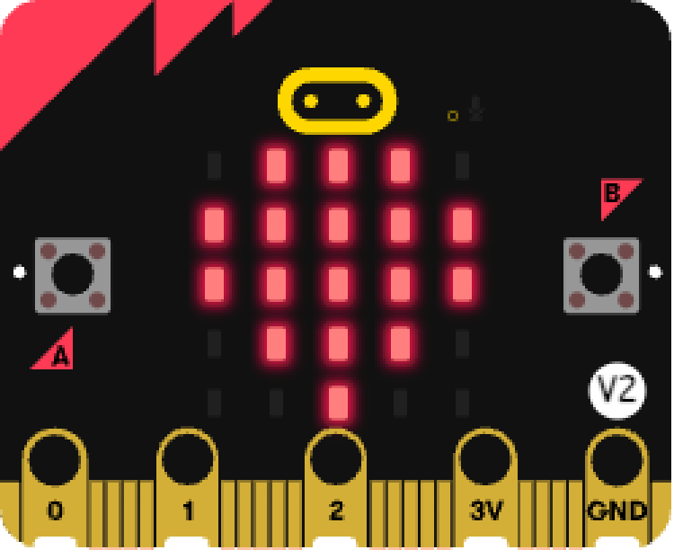{width="300"}. 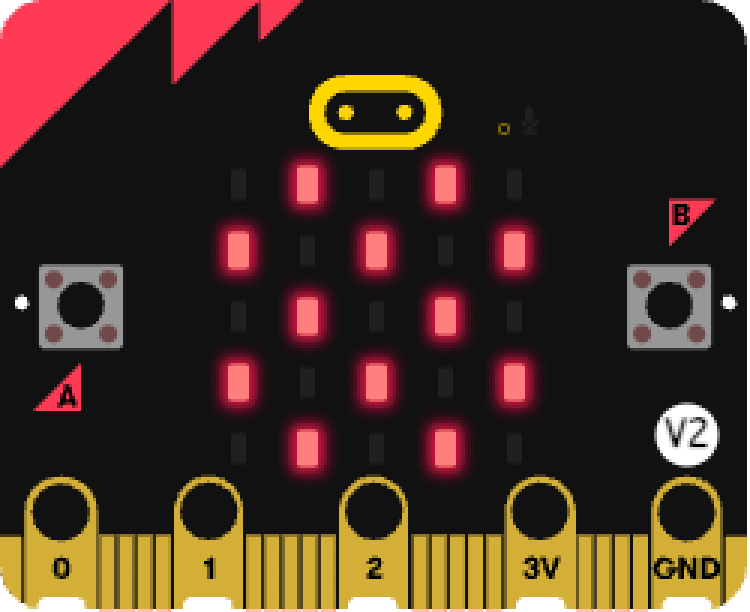{width="300"}

The Balloon Analogue Risk Task (BART) is a measure of risk taking propensity. Participants engage in a risk taking task in order to recieve a hypothetical reward. The riskier a participant acts, the higher the potential gains but also the higher potential for losses.

The BART involves blowing up a balloon via individual pumps. After each pump, a participant can choose to bank some money/points. As the balloon size increases, the money/points which can be banked increases. However, the balloon can pop after any pump, resulting in no money/points being banked for that balloon. Participants are therefore required to pump the balloon to as large a size as they can, without popping it, in order to bank the most money/points. However, the probability of popping the balloon increases with every pump, making it a gamble to grow the balloon to a large size.

Completing the BART task once in a laboratory setting is often considered a valid measure of someones trait-level risk taking. In other words a persons stable propensity to engage in risky behaviours across situations and time. However, recent work has suggested that their might be intraindividual variability in someones risk taking behaviours; meaning that peoples risk taking propensity might actually change across time and situations (see doi: 10.1007/s10862-017-9628-4, [or click here!](https://doi.org/10.1007/s10862-017-9628-4) )

To test this, a mobile version of the BART task is needed, that can be completed 'on-the-go'. It is possible that the micro:bit can be a portable alternative to lab based assessments of the BART.

# **Step 1: Make it**

A micro:bit compatible version of the BART can be found here: <https://github.com/h-shawberry/makecode-BART>

In this tutorial, we will be building this BART task in MakeCode.

## **How it works:**

### Variables:

The programme uses several variables to store important information:

-   **BalloonLevel** -- how big the balloon is right now

-   **PopLevel** -- the secret number when the balloon will finally pop

-   **Pot** -- how many points the player has banked

-   **round** -- which round the player is on

-   **nPumps** -- how many times a player pressed A

-   **nPops** -- how many balloons popped

-   **Pause** -- a true/false variable the micro:bit uses to decide if the game should accept button presses or not

For example, when **Pause = true**, the micro:bit ignores the A and B buttons --- this happens when:

-   The balloon has just popped

-   A player has just banked points

-   The game has ended and is showing the final score

-   Instructions are being shown

When **Pause = false**, the player can pump and bank again.

Therefore, the **Pause** variable stops the player from pressing buttons during important moments and keeps the game running smoothly.

### Data Logging:

The programme also utilises the datalogger extension. At the end of the game it stores information on how the player interacted with the game so their level of risk can be analysed and compared to other players. The data saved includes:

-   The number of popped balloons

-   The overall number of pumps made by the player

-   The number of rounds (aka number of balloons played)

-   The number of points banked (contents of the pot)

-   A variable called adjusted pumps which represents the average number of pumps on balloons that did not explode

Apart from the number of rounds, the above data are all indicators of risk taking propensity.

### Forever Loop:

The programme also uses a forever loop to constantly check:

-   Has the balloon reached the pop level for that round?

-   Have we played enough rounds?

-   Are both buttons pressed to end the game early?

### if...else statements:

To show the balloon growing on the LED screen, the micro:bit uses a long chain of **if... else** statements.

This means:

-   **If** the balloon level is 1 → show a tiny balloon

-   **Else if** the balloon level is 2 → show a slightly bigger balloon

-   **Else if** it reaches 3, 4, 5... → show bigger and bigger balloons

-   **If it reaches 10** → show the biggest balloon

-   **Else** → show nothing

Each balloon level also plays a different musical note, so the balloon looks and sounds like it's growing.

This is how the micro:bit knows exactly which picture to show at each moment.

### Functions:

The programme uses functions to avoid duplicate block code.

#### **FullReset()**

Sets everything back to the beginning of the game:\
balloon size = 0, pumps = 0, pops = 0, round = 1, Pot = 0, new random pop point.

#### **Instructions()**

Shows the player what the game looks like- a growing balloon animation, and the words *Pump* and *Bank* with arrows indicating which button to press for each.

#### **RoundEnd()**

Starts the next round:\
balloon goes back to size 0, and a brand‑new secret pop number is chosen.

#### **showBallonLevelLED()**

Shows different balloon shapes on the LEDs depending on how many pumps have happened. It also plays higher and higher musical notes as the balloon grows!

#### **HappyEnd()**

Runs when the whole game is finished:\
Shows your total points, logs results, and then resets the game.

## **What you need**

-   A micro:bit V2

-   USB-C to Micro USB Cable

-   Computer/Tablet with internet access so you can visit [makecode.microbit.org](makecode.microbit.org)

-   Optional: Battery pack for micro:bit and 2x AA batteries.

-   Load the Datalogger extension into makecode session. Add via **Extensions → "datalogger"**

## **Gather data**

-   Transfer the programme below to your micro:bit.

-   You can record data anywhere if you unplug the micro:bit from your computer and connect a battery pack.

-   Any previous data is erased when you transfer new code to your micro:bit

-   You can also download the data as a CSV (comma separated values) file which you can also import into a spreadsheet.

## **Analyse data**

-   When you've collected your data, plug the micro:bit into a computer.

-   The micro:bit appears like a USB drive called MICROBIT.

-   Open the MY_DATA file to see a table of all BART data recorded in your web browser

-   Click download to export the data as a .csv file

    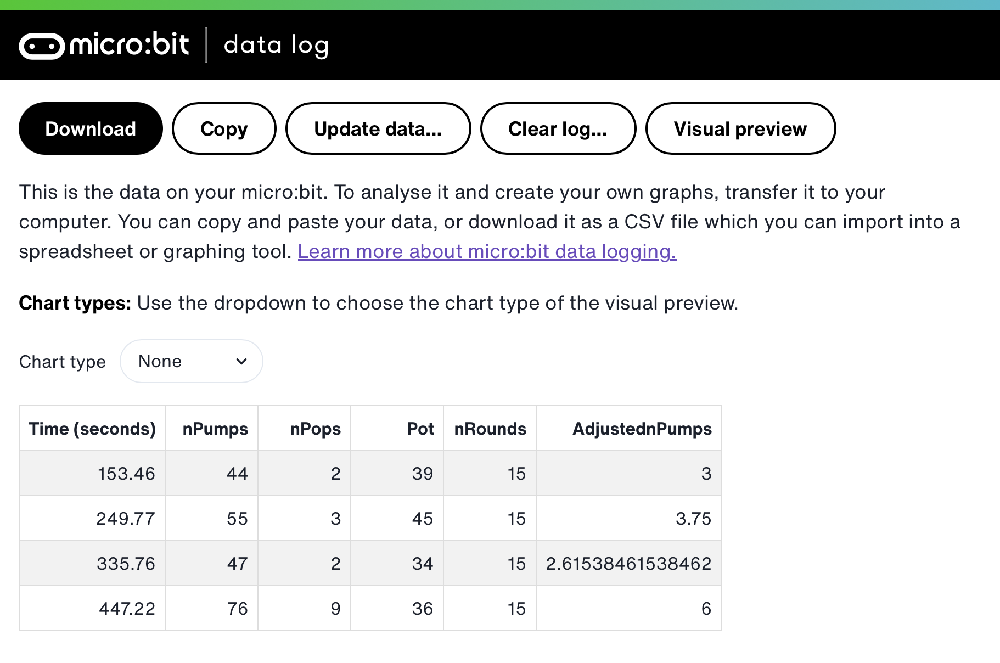

  

# **Step 2: Code it**

1)  **Function: `FullReset()`**

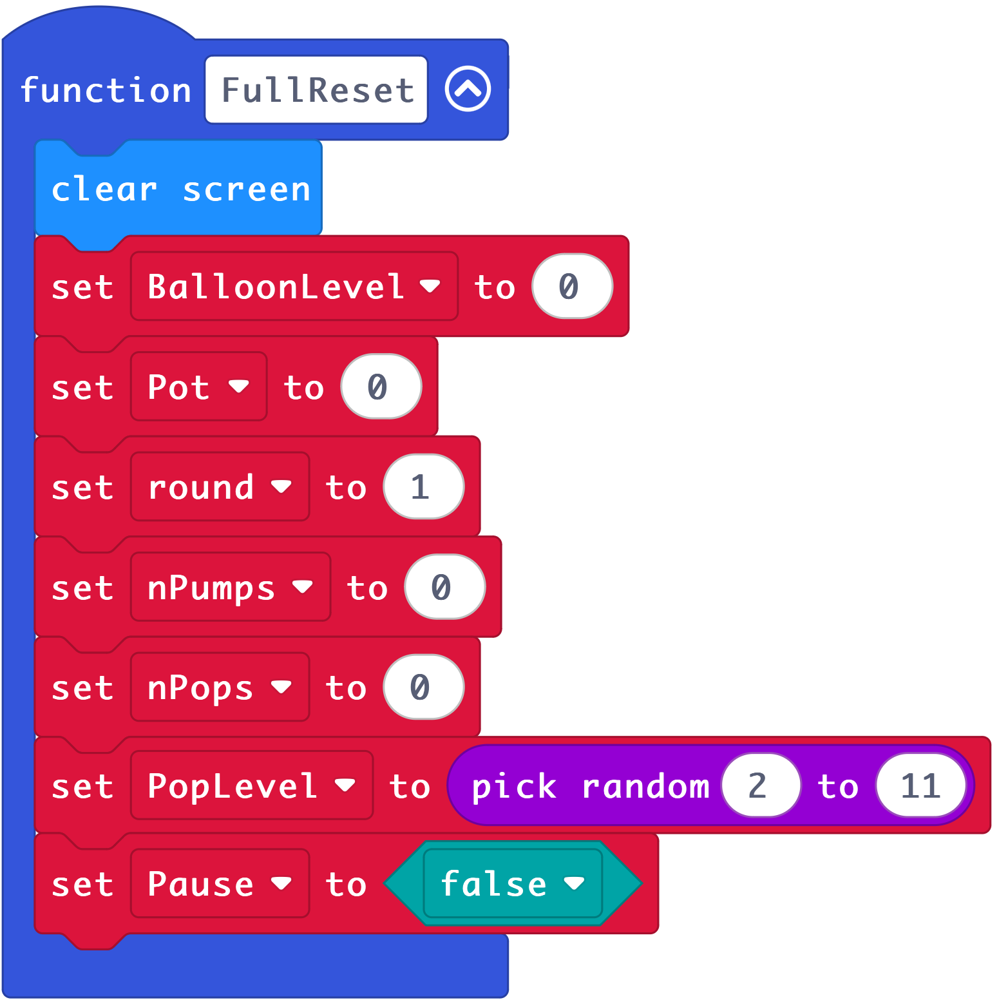{width="600"}

2)  **Function: `Instructions()`**

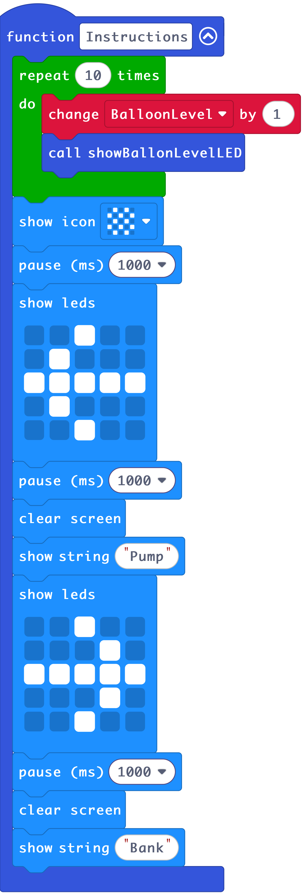{width="274"}

3)  **Function: `RoundEnd()`**

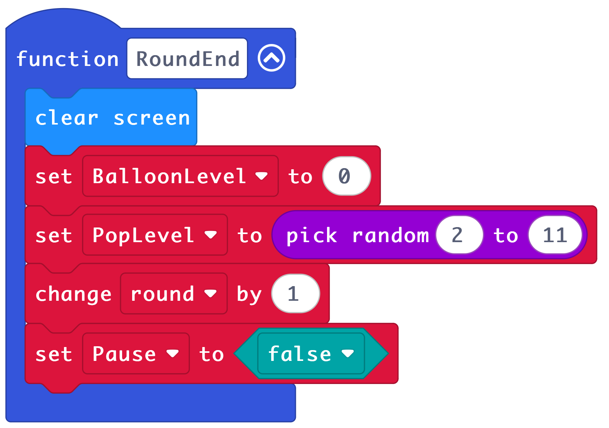{width="600"}

4)  **Function: `showBallonLevelLED()`** This is one long block in makecode, represented here in 2 columns:

**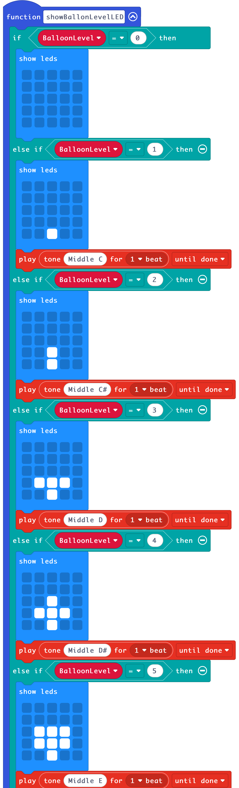{width="250"}** 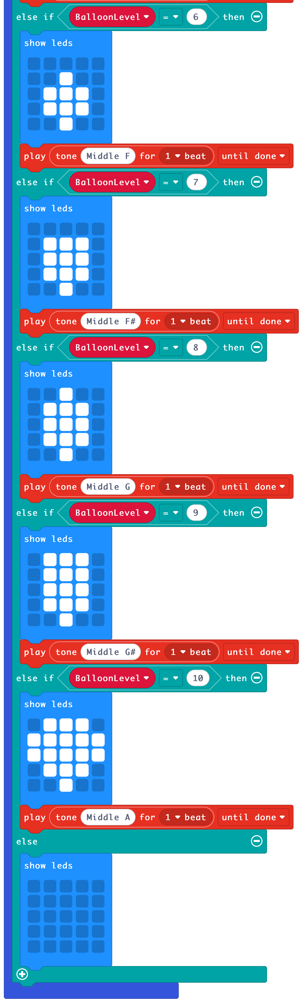{width="250"}

5)  Function: `HappyEnd()`

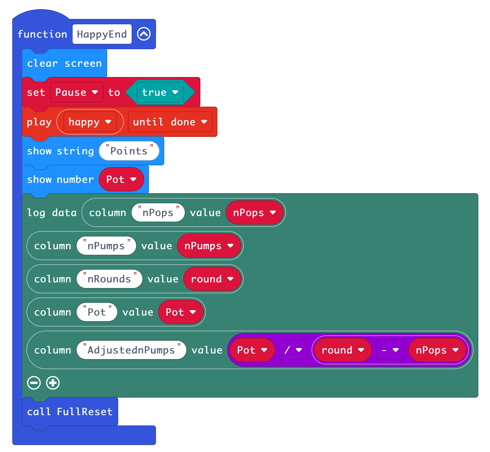{width="600"}

6)  Button A: **Pump**

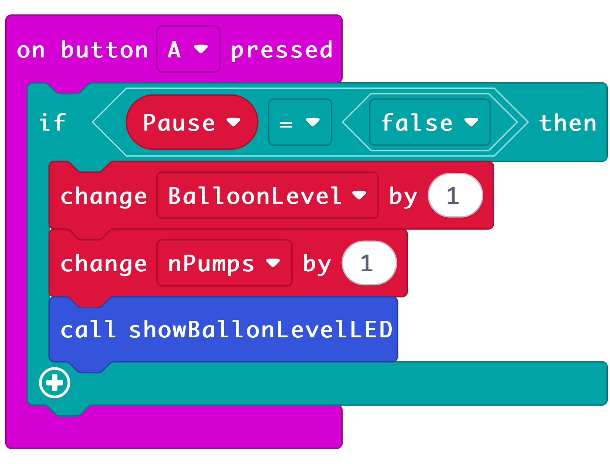{width="600"}

7)  Button B: **Bank**

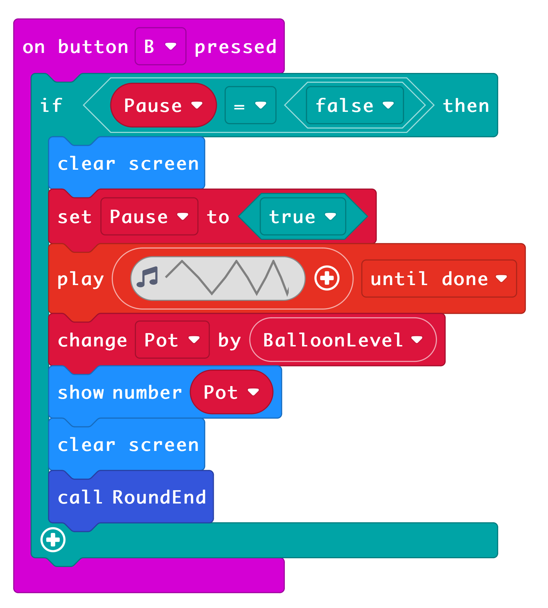{width="600"}

8)  **Forever Loop:**

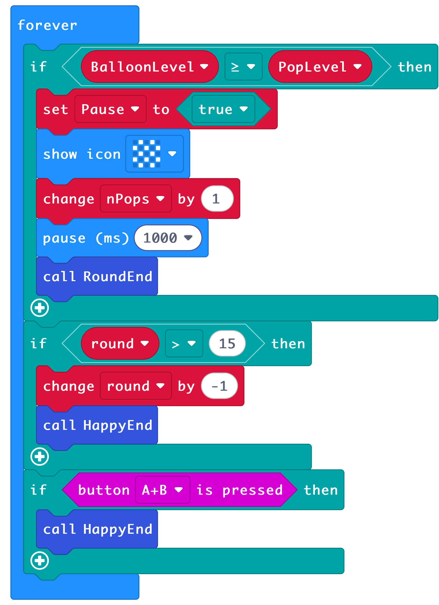{width="507"}

9)  **On Start:**

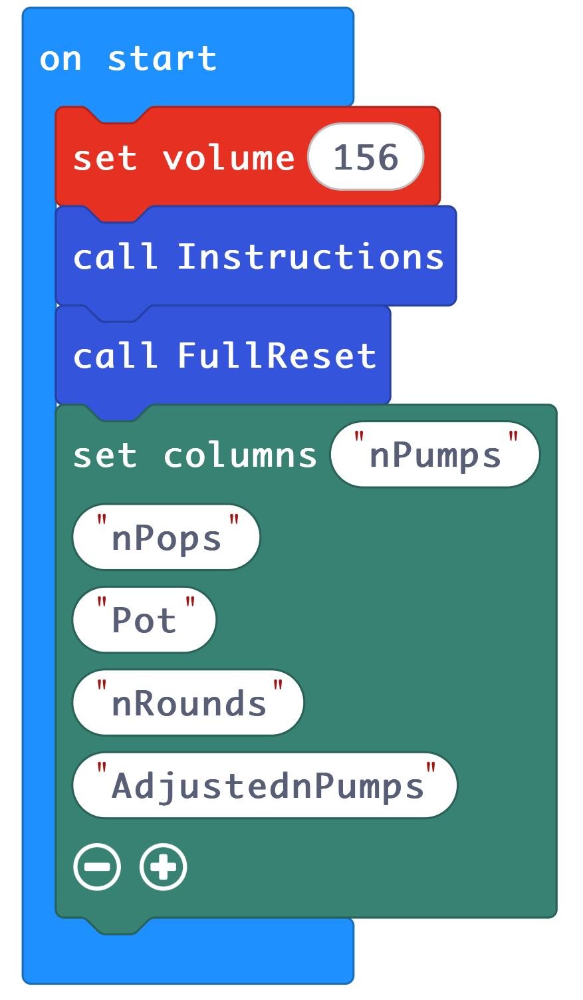{width="408"}

# **Step 3: Improve it:**

-   Adjust the sound level to your desired volume.

-   Adjust the sound effects, and maybe add one for a balloon pop.

-   You could add more things to the data logger, such as average length of time per round.

-   You could log the highest balloon level achieved per game.

-   You could change the range in the random number generator to make the game easier or harder. e.g.

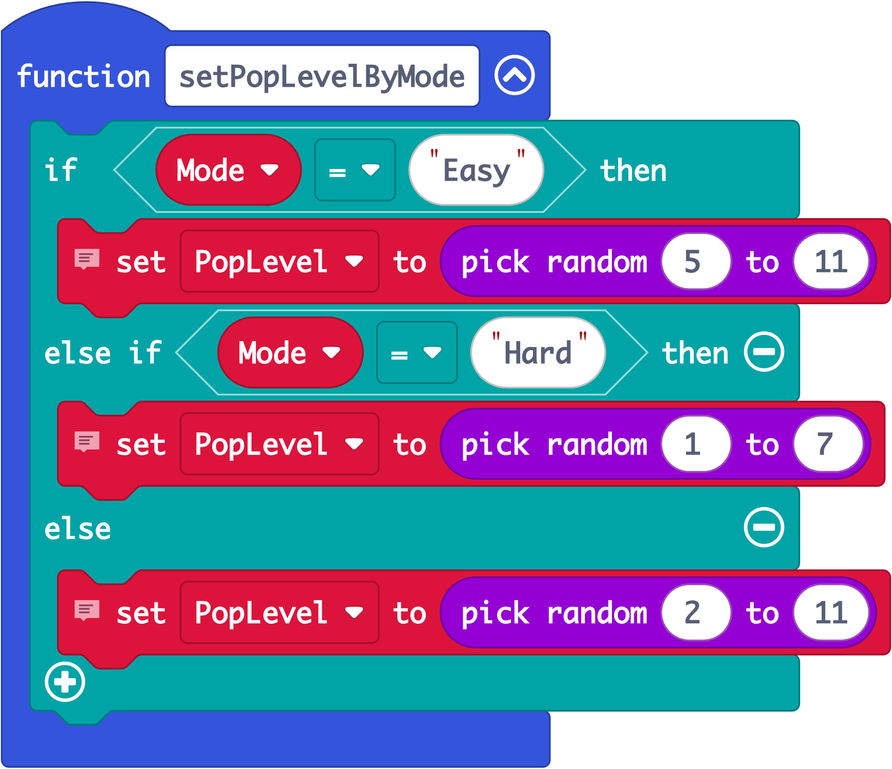{width="500"}

-   You could make the game harder as time goes on.

-   Analyse your data, write up your findings. How does the micro:bit BART relate to lab based assessments? Do scores on the micro:bit BART correlate with risk taking behaviours? 

# **Balloon Game Instructions**

You are going to play a balloon‑pumping game using the micro:bit.

## Your aim

Try to collect as many points as you can.\
The more you pump, the more points you might earn ---\
**but pump too much and the balloon might pop!**

## How the game works

-   You will see a small balloon on the micro:bit screen.

-   Each balloon is a *round*. You will play **up to 15 rounds**.

## Pumping the balloon (Button **A**)

-   Press **A** to pump up the balloon.

-   Each pump makes the balloon grow on the screen.

-   Every pump gives you **1 point**, but these points are only *saved* if you decide to 'bank' them.

-   The balloon might pop if you pump too much!

## Banking your points (Button **B**)

-   Press **B** to bank your points.

-   When you bank them, they are safely added to your **total score**.

-   Your new total will briefly appear as a number on the screen.

-   After you bank your points, the next balloon begins.

## If the balloon pops:

-   Balloons can pop **without warning**.

-   If a balloon pops:

    -   You **lose the points from that balloon only**.

    -   Your **total score stays safe**.

    -   You will see a pop pattern on the screen.

    -   Then the next balloon begins.

## When the game ends

-   After all the balloons, the micro:bit will show:

    -   The word **"Points"**

    -   Then your **final score**
